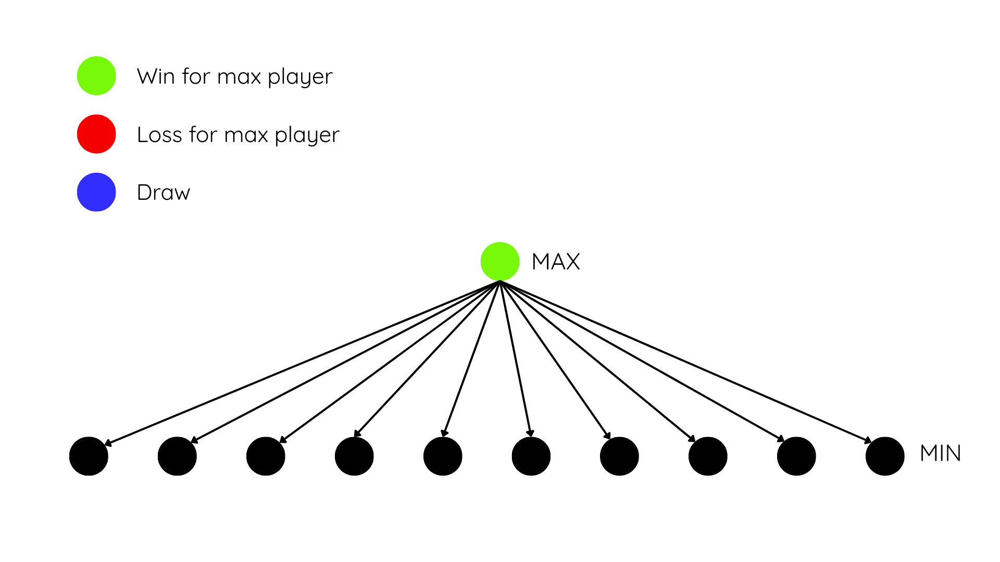

# Implicit, but Deterministic Generation of Graphs

  

## Table of Contents

- [Introduction](#introduction)

- [Getting Started](#getting-started)

- [Basic Usage](#basic-usage)

- [Parameters](#parameters)

- [Default Behavioural Functions](#default-behavioural-functions)

- [Use of Deterministic Randomness in Custom Functionality](#use-of-deterministic-randomness-in-custom-functionality)

- [API Reference](#api-reference)

- [License](#license)

  

# Introduction

  

  

This API allows users to generate variety of state-space graphs. The tool allows the user to use simple predefined graphs, or to fine-tune the graph by using user-defined function passing. Using Hashing and a starting seed, reproducability is ensured for each graph. This tool supports user control over branching factor, depth, values of states, heuristic values of states, cycles and transpositions among other features.

  

  

An accompanying research paper can be found [here](www.example.org).

  

  

# Getting Started

  

First, you install it:


....

# Basic Usage

  

Initialize a new state-space graph by using the `State` constructor.

  

```python
state = State()
```

  

This creates a simple graph, with default values for each parameter. This default graph is a binary tree, with no maximum depth, no state values and no transpositions or cycles.

  
<a name="minimax-search"></a>
Example of a minimax search in the graph:

```python
from State import State
from custom_types import Player

INF = 1000
visited: dict[int, int] = {}
def minimax(state: State, depth: int) -> int:
	if state.id() in visited.keys():
		return state.true_value()
	if state.is_terminal():
		return state.true_value()
	if depth == 0:
		return state.heuristic_value()
	
	if state.player() == Player.MAX:
		max_eval = -INF
		for action in state.actions():
			state.make(action)
			s_eval = minimax(state, depth-1)
			state.undo()
			max_eval = max(max_eval, s_eval)
		visited[state.id()] = max_eval
		return max_eval
	else:
		min_eval = INF
		for action in state.actions():
			state.make(action)
			s_eval = minimax(state, depth-1)
			state.undo()
			min_eval = min(min_eval, s_eval)			
		visited[state.id()] = min_eval
		return min_eval

def main():
	state = State(max_depth=9)
	val = minimax(state, 9)
	print(f"Minimax Value: {val}")
	print(f"True value: {state.true_value()}")

main()
```

<a name="parameters"></a>
# Parameters

-  **`seed`** (`int`, default: `0`, range: `Positive Integer`)
Determines the starting seed for the graph generator. Ensures reproducibility.

-  **`max_depth`** (`int`, default: `2^8 - 1`)
Sets the maximum depth of the graph. If `None`, the graph can grow infinitely deep.

-  **`distribution`** ([`RandomnessDistribution`](#RandomnessDistribution), default: `Dist.UNIFORM`, option: `Uniform` or `Gaussian`)Determines what distribution the random number generator follows.

-  **`root_value`** (`int`, default: `0`, Allowed Values: `-1`, `0`, `1`)
The true value of the root node

-  **`retain_tree`** (`bool`, default: `False`)
Stores tree in memory, used to draw tree

-  **`branching_factor_base`** (`int`, default: `2`, range: `Positive Integers`)
The number of child nodes each state can generate.


-  **`branching_factor_variance`** (`int`, default: `0`, range: `Positive Integer`)
How much the branching factor can vary.
  
-  **`terminal_minimum_depth`** (`int`, default: `0`, range: `Positive Integer`)
Defines how deep a state must be before it can be considered terminal.

-  **`child_depth_minimum`** (`int`, default: `1`)
Defines the minimum depth of a child.

  
-  **`child_depth_maximum`** (`int`, default: `1`)
Defines the maximum depth of a child.

-  **`locality `** (`float`, default: `0`, range: `[0, 1]`)
Controls how much of the available state space can be used when generating children. A value of `0` allows use of the full space at each depth; higher values restrict generation to a smaller portion of it.

<a name="true-value-parameters"></a>

-  **`true_value_forced_ratio`** (`float`, default: `0.1`, range: `[0, 1]`)
Controls the ratio of children that are `forced` to share the same true value as their parent state. (NOTE: this is a strict lower bound and setting this to zero breaks the integrity of true value propagation.)

-  **`true_value_similarity_chance`** (`float`, default: `0.5`, range: `[0, 1]`)
After meeting the minimum forced match requirement, this sets the chance that a remaining child will also take on the parent’s true value (A value of `0` means only forced nodes inherit the parent’s value; `1` means all children do).

-  **`true_value_tie_chance `** (`float`, default: `0.2`, range: `[0, 1]`)
For children not covered by `forced value` or `similarity chance`, this sets the probability of the child being assigned a draw. (NOTE: the actual expected number og draws is dependent on `true_value_forced_ratio` and `true_value_similarity_chance`)


    

-  **`symmetry_factor`** (`float`, default: `1.0`, range: `[0, 1]`)
What

-  **`symmetry_frequency`** (`float`, default: `0.0`, range: `[0, 1]`)
What

-  **`heuristic_accuracy_base`** (`float`, default: `0.7`, range: `[0, 1]`)
What

-  **`heuristic_depth_scaling`** (`float`, default: `0.5`, range: `[0, 1]`)
What

-  **`heuristic_locality_scaling`** (`float`, default: `0.5`, range: `[0, 1]`)
What


-  **`branching_function`** (`function`, default: [`default_branching_function`](#default_branching_function))
A custom function provided by the user to determine the branching factor of states.

-  **`value_function`** (`function`, default: [`default_value_function`](#default_value_function))
A custom function provided by the user to determine the true values of states.

  

-  **`child_depth_function`** (`function`, default: [`default_child_depth_function`](#default_child_depth_function))
A custom function provided by the user to determine the depth of each child.


-  **`transposition_space_function`** (`function`, default: [`default_transposition_space_function`](#default_transposition_space_function))
A custom function provided by the user to define the upper bound of unique states at each depth (returns a dictionary).

-  **`heuristic_value_function`** (`function`, default: [`default_heuristic_value_function`](#default_heuristic_value_function))
A custom function provided by the user to determine the heuristic values of states.


# Default Behavioural Functions

Passing in functions as parameters allows the user to gain fine-grained control over the structure of the generated graph. All of the behavioural functions passed in, must have the following parameters (plus some function-specific parameters):
-  **Parameters:**
	-  `randint` ([`RandomIntFunction`](#use-of-deterministic-randomness-in-custom-functionality)): A callable that returns random integers given a range and distribution.
	-  `randf` ([`RandomFloatFunction`](#use-of-deterministic-randomness-in-custom-functionality)): A callable that returns random floats given a range and distribution.
  
  
---
  

### `default_branching_function()`
-  **Parameters:**
	-  `params` (`StateParams`): A container holding global and local state information.
-  **Return Type : `int`**
-  **Description:** Uses the `randf` function to add random variance (bounded by `branching_factor_variance`) to the `base_branching_factor` and returns this value.

  

---

### `default_value_function()`
-  **Parameters:**
	-  `params` (`StateParams`): A container holding global and local state information.
	-  `self_branching_factor` (`int`): The number of children associated with the current state.
	-  `child_true_value_information` (`ChildTrueValueInformation`): Stores data on the true values of all children generated so far.
-  **Return Type : `int`**

-  **Description:** Generates a true value for a child state. Ensures that the values behave in a sensible manner by adhering to the rules and the [true value parameters](#true-value-parameters).

---

### `default_child_depth_function()`
-  **Parameters:**
	-  `params` (`StateParams`): A container holding global and local state information.

-  **Return Type : `int`**

-  **Description:** Uses the `randint` to randomly generate a depth between minimum and maximum child depth and returns that value.

---

### `default_transposition_space_function()`

-  **Parameters:**
	-  `globals` (`GlobalVariables`): A container holding global state information.

	-  `depth` (`int`): An integer specifying the depth of the current state.

-  **Return Type : `int`**

-  **Description:** Uses `globals` to return the maximum number of different states per depth, ensuring minimal transpositions.
---

### `default_heuristic_value_function()`

-  **Parameters:**
	-  `params` (`StateParams`): A container holding global and local state information, including depth and branching settings.

-  **Return Type : `int`**

-  **Description:** Simulates a heuristic function with 70%-85% accuracy depending on depth.

  

# Use of Deterministic Randomness in Custom Functionality

  

Each state in the graph has access to a deterministic random number generator. This allows user-defined functions to behave consistently across runs. The random generators are exposed through two helper functions:


### `RandomIntFunction` and `RandomFloatFunction`


**Return Values:**
-  `RandomIntFunction`: `int`
-  `RandomFloatFunction`: `float`

Both functions sample a number between `low` and `high`, following the specified `distribution`.

If no distribution is provided, the default distribution set during initialization is used (typically uniform).

  

-  **Parameters:**

	-  `low`: The minimum value to sample from (`int` for `RandomIntFunction`, `float` for `RandomFloatFunction`).

	-  `high`: The maximum value to sample from (`int` for `RandomIntFunction`, `float` for `RandomFloatFunction`).

	-  `distribution` (`RandomnessDistribution`): Optional. Specifies the distribution to use when sampling.

  

**Example Usage:**

Graph where each state has a uniform branching factor between 0 and 3

```python

  

def  uniform3_branching_function(randint: RandomIntFunction, randf: RandomFloatFunction, params: StateParams) -> int:

return randint(low=0, high=3, distribution=RandomnessDistribution.UNIFORM)

  

state = State(branching_function=uniform3_branching_function)

  

```

# Custom Types and Containers

**`StateParams`**

`StateParams` is a dataclass that stores all relevant information about a state. The API automatically passes an instance of this object to user-defined functions, enabling access to state-related parameters from outside the class.

`StateParams` is composed of two subcomponents:


**`GlobalVariables`**

`GlobalVariables` is a dataclass that stores global information. It's essentially a copy of the [parameters](#parameters) of the class 


**`StateParamsSelf`**

`StateParamsSelf` is a dataclass the stores local information about the current state node of the class. 

NOTE on the 3 classes above:
The reason `StateParams` is split into these subclasses is that not all of the custom functions need access to everything.


# Custom Types and Containers

### **`StateParams`**

`StateParams` is a dataclass that stores all relevant information about a state. The API passes an instance of this object to user-defined functions, enabling access to state-related parameters from outside the class.

`StateParams` is composed of two subcomponents:
- [`GlobalVariables`](#globalvariables): global parameters shared across the entire graph
- [`StateParamsSelf`](#stateparamsself): local information specific to the current state node

> **Note:** This separation exists because not all custom functions require access to both global and local data. Separating them helps ensure that functions only receive the data they actually need.


### **`GlobalVariables`**

`GlobalVariables` is a dataclass that stores information shared across the entire graph. It mirrors the configuration options passed in during initialization — essentially a copy of the class’s [parameters](#parameters).


### **`StateParamsSelf`**

`StateParamsSelf` is a dataclass containing local information about the current `State` node, such as its depth, parent relationship, or node-specific values.

___

<a name="RandomnessDistribution"></a>

### **`RandomnessDistribution`**

`RandomnessDistribution` is an enum with two options: UNIFORM and GAUSSIAN. It specifies the distribution type used by the random number generator.
```python
from custom_types import RandomnessDistribution

state = State(distribution=RandomnessDistribution.GAUSSIAN)
```
In this case, all random number generation will default to a Gaussian distribution unless overridden.

You can override the distribution in specific functions:

```python
from custom_types import RandomnessDistribution

def uniform3_branching_function(randint:RandomIntFunction, randf: RandomFloatFunction, params: StateParams) -> int:
	return randint(low=0, high=3, distribution=RandomnessDistribution.UNIFORM)

state = State(distribution=RandomnessDistribution.GAUSSIAN)
```
Here, the state's default is Gaussian, but `randint` in `uniform3_branching_function` explicitly uses a uniform distribution.


### **`Player`**

Player is an enum with two values: MIN and MAX. It is used by the API to identify the current player and can also be utilized by users in search algorithms.
For a more detailed usage, see the [minimax example](#minimax-search).

# API Reference

| Method              | Description                                                                 | Arguments                                   |
|---------------------|-----------------------------------------------------------------------------|---------------------------------------------|
| `id()`              | Returns the ID of the current state.                                        | None                                        |
| `is_terminal()`     | Returns `True` if the current state is terminal (a leaf node), else `False`. | None                                        |
| `is_root()`         | Returns `True` if the current state is the root of the graph, else `False`. | None                                        |
| `value()`           | Returns the true (actual) value of the current state.                       | None                                        |
| `heuristic_value()` | Returns the heuristic estimate of the state's value.                        | None                                        |
| `actions()`         | Returns a list of integers representing available actions from this state.  | None                                        |
| `make(action)`      | Transitions the current state by applying the specified action.             | `action` (int): The action to apply.       |
| `make_random()`     | Randomly applies one of the available actions.                              | None                                        |
| `undo()`            | Undoes the last action taken.                                               | None                                        |
| `draw()`            | Visualizes the current state and its immediate children.                    | None                                        |


# License


GPL3 ?